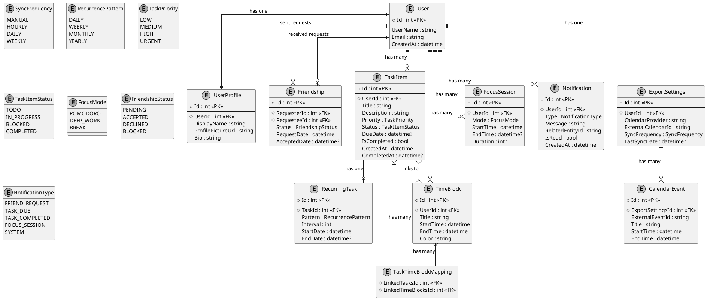

```plantuml
@startuml ProductivityApp

' Styling
skinparam linetype ortho
skinparam monochrome true
skinparam packageStyle rectangle
skinparam shadowing false
skinparam handwritten false

' Entities
entity "User" as User {
  + Id : int <<PK>>
  --
  UserName : string
  Email : string
  CreatedAt : datetime
}

entity "UserProfile" as UserProfile {
  + Id : int <<PK>>
  --
  # UserId : int <<FK>>
  DisplayName : string
  ProfilePictureUrl : string
  Bio : string
}

entity "Friendship" as Friendship {
  + Id : int <<PK>>
  --
  # RequesterId : int <<FK>>
  # RequesteeId : int <<FK>>
  Status : FriendshipStatus
  RequestDate : datetime
  AcceptedDate : datetime?
}

entity "TaskItem" as TaskItem {
  + Id : int <<PK>>
  --
  # UserId : int <<FK>>
  Title : string
  Description : string
  Priority : TaskPriority
  Status : TaskItemStatus
  DueDate : datetime?
  IsCompleted : bool
  CreatedAt : datetime
  CompletedAt : datetime?
}

entity "RecurringTask" as RecurringTask {
  + Id : int <<PK>>
  --
  # TaskId : int <<FK>>
  Pattern : RecurrencePattern
  Interval : int
  StartDate : datetime
  EndDate : datetime?
}

entity "TimeBlock" as TimeBlock {
  + Id : int <<PK>>
  --
  # UserId : int <<FK>>
  Title : string
  StartTime : datetime
  EndTime : datetime
  Color : string
}

entity "FocusSession" as FocusSession {
  + Id : int <<PK>>
  --
  # UserId : int <<FK>>
  Mode : FocusMode
  StartTime : datetime
  EndTime : datetime?
  Duration : int?
}

entity "Notification" as Notification {
  + Id : int <<PK>>
  --
  # UserId : int <<FK>>
  Type : NotificationType
  Message : string
  RelatedEntityId : string
  IsRead : bool
  CreatedAt : datetime
}

entity "ExportSettings" as ExportSettings {
  + Id : int <<PK>>
  --
  # UserId : int <<FK>>
  CalendarProvider : string
  ExternalCalendarId : string
  SyncFrequency : SyncFrequency
  LastSyncDate : datetime?
}

entity "CalendarEvent" as CalendarEvent {
  + Id : int <<PK>>
  --
  # ExportSettingsId : int <<FK>>
  ExternalEventId : string
  Title : string
  StartTime : datetime
  EndTime : datetime
}

entity "TaskTimeBlockMapping" as TaskTimeBlockMapping {
  # LinkedTasksId : int <<FK>>
  # LinkedTimeBlocksId : int <<FK>>
}

' Enumerations
enum "SyncFrequency" {
  MANUAL
  HOURLY
  DAILY
  WEEKLY
}

enum "RecurrencePattern" {
  DAILY
  WEEKLY
  MONTHLY
  YEARLY
}

enum "TaskPriority" {
  LOW
  MEDIUM
  HIGH
  URGENT
}

enum "TaskItemStatus" {
  TODO
  IN_PROGRESS
  BLOCKED
  COMPLETED
}

enum "FocusMode" {
  POMODORO
  DEEP_WORK
  BREAK
}

enum "FriendshipStatus" {
  PENDING
  ACCEPTED
  DECLINED
  BLOCKED
}

enum "NotificationType" {
  FRIEND_REQUEST
  TASK_DUE
  TASK_COMPLETED
  FOCUS_SESSION
  SYSTEM
}

' Relationships
User ||--o{ TaskItem : "has many"
User ||--o{ TimeBlock : "has many"
User ||--o{ FocusSession : "has many"
User ||--o{ Notification : "has many"
User ||--|| UserProfile : "has one"
User ||--|| ExportSettings : "has one"

User ||--o{ Friendship : "sent requests"
User ||--o{ Friendship : "received requests"

TaskItem ||--o| RecurringTask : "has one"
TaskItem }--{ TimeBlock : "links to"

ExportSettings ||--o{ CalendarEvent : "has many"

TaskItem }|--|| TaskTimeBlockMapping : "has many"
TimeBlock }|--|| TaskTimeBlockMapping : "has many"

@enduml
```